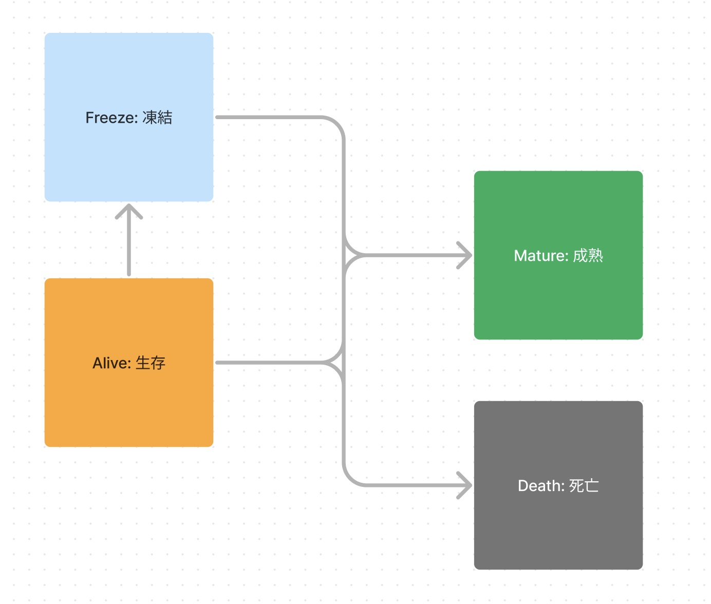

# Introduction to RFCs

<!-- toc -->

## Pulsate RFCs とは

Pulsate RFCs (以下 RFCs ) は Pulsate への大規模な変更や新機能, コミュニティ運営の提案を行うためのプロセスです.

小さな変更やバグ修正やドキュメント改善は RFCs を通さずに直接実施することが出来ますが, プロジェクトに大きく関わる変更は RFCs を使いコミュニティメンバーとの議論及びプロジェクトチームとの間での共有を図るようにしてください.

## RFCs が必要なケース・必要ではないケース

RFCs が必要なケースとしては大まかに以下のようなものがあります:

- 新機能の提案
- 既存機能の変更・削除
- コミュニティ運営の提案

逆に RFCs が必要ないケースとしては以下のようなものがあります:

- 小さな変更やバグ修正, リファクタリング
- ドキュメント改善
- テストの追加・修正

ただし仕様を大きく変更する場合は RFCs を作成する必要があります.

RFCs を提出せずに変更を行ったプルリクエストを提出した場合 RFCs プロセスを通すように指示されることがあります.

## 提出する前に

以前に RFCs で却下された提案やロードマップに合わない提案, 実装することに見合わない提案はすぐに却下される可能性があります.

RFCs を提案する前に Discord などでユーザーや開発者など他のコミュニティメンバーあらのフィードバックを受けてから提案することをお勧めします.

## RFCs プロセスの流れ

Pulsate RFCs プロセスの基本的な流れは以下の通りです:

1. `pulsate-dev/rfcs` リポジトリをフォークする
2. `proposal` ディレクトリにプロポーザルを追加し, PR を作成する
3. PR 内でプロジェクトチームとコミュニティとで提案に関する議論を行う
4. 議論内容を垣間見て, **プロジェクトチームによりその提案に対する Approve / Reject を決定する**
5. GItHub Actions を使用し, `rfcs.pulsate.dev` にプロポーザルを追加して RFCs が承認されます.

## 定義

### Pulsate RFCs Tracking Number

RFCs の固有番号は提案が承認された後に当ドキュメントに追加され, そこで初めて割り当てられます. これらの固有番号は Pulsate RFCs Tracking Number (PRTN) と呼び, 各提案に一つだけ割り当てられます.

### Pulsate RFCs Lifecycle

RFCs の生存サイクルは以下の通りです:

- `Alive` (生存)
  - RFCs が生きていて, まだ議論段階の状態.
- `Mature` (成熟)
  - RFCs が承認された状態.
- `Death` (死亡)
  - RFCs が Reject され, 議論が行われていない状態
- `Freeze` (凍結)
  - RFCs が何らかの理由で延期されている状態

`Death` になった提案は基本的に `Alive` や `Mature` になることはありません.

----

Pulsate RFCs は [Rust RFCs](https://github.com/rust-lang/rfcs) を参考に制定, 運用されています.
